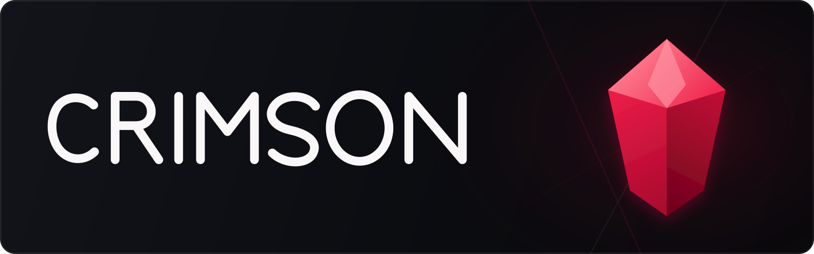

<p align="center">
  
</p>

<p align="center">
  A modern, unofficial desktop client for browsing, installing, and launching your Epic Games library.
</p>

<p align="center">
  <a href="https://github.com/Foxtrot47/Crimson/actions/workflows/dotnet-winui3.yml"></a>
  <a href="LICENSE.txt"></a>
</p>

> [!IMPORTANT]
> Crimson is an independent, open-source project. It is not affiliated with, authorized by, or endorsed by Epic Games, Inc.

## Features

- Sign in through Epic Games' embedded authentication flow.
- Browse your owned games with metadata and artwork.
- Search your library and the Epic Games Store from one place.
- Browse the Store, including authentication and checkout, without leaving Crimson.
- Install, update, verify, repair, move, and uninstall supported games.
- Pause, resume, or cancel downloads and monitor the installation queue.
- Launch games with fresh Epic credentials and ownership tokens when required.
- Optionally create per-game Start menu and desktop shortcuts.

## Platform status

The current Crimson Launcher frontend supports **64-bit Windows 10 version 1809 or later** and requires the [Microsoft Edge WebView2 Evergreen Runtime](https://developer.microsoft.com/microsoft-edge/webview2/#download-section) for Epic sign-in and Store access. The runtime is already present on most current Windows installations.

The application is being separated into a portable core and platform-specific frontends, but Linux and macOS applications are not available yet.

Crimson is under active development. Back up anything important and expect behavior to change between pre-release versions.

## Install Crimson

When a tagged build is available, it is published on the [GitHub Releases](https://github.com/Foxtrot47/Crimson/releases) page in two user-installable formats.

### Portable ZIP

1. Download `Crimson-X.Y.Z-win-x64.zip`.
2. Extract the archive to a writable folder.
3. Run `Crimson.exe`.

The portable ZIP includes the required .NET runtime and does not require certificate installation. WebView2 remains a separate prerequisite.

### MSIX

The GitHub MSIX is signed with Crimson's persistent self-signed certificate:

1. Download the matching `.msix` and `.cer` files.
2. Import the certificate into the current user's **Trusted People** certificate store.
3. Open the `.msix` to install Crimson Launcher.

See [Installing and releasing Crimson](docs/RELEASING.md) for detailed installation steps, package differences, and checksum verification.

## Using Crimson

1. Launch Crimson and sign in with your Epic Games account.
2. Select a title from **Library**, or search from the title bar.
3. Choose **Install** and configure the location, optional content, and shortcuts.
4. Follow active and queued work from **Downloads**.
5. Launch an installed game from its page, the navigation pane, or a Crimson-created shortcut.

The embedded **Store** can be used to browse and acquire games. Newly acquired titles appear after Crimson refreshes account ownership.

## Local data and credentials

The portable build keeps its data under `%LOCALAPPDATA%\Crimson`. Packaged builds can map that location into Windows-managed package storage. Use **Settings → Open Logs Directory** to open the effective log location for the running build.

Application data includes logs, the embedded Epic sign-in and Store browser profile, cached metadata and artwork, manifests, and installation state.

Epic credentials stored by the Windows frontend are encrypted at rest with Windows Data Protection API (DPAPI). Temporary ownership-token files created for a game launch are removed after the game exits.

## Build from source

### Requirements

- Windows 10 version 1809 or later, x64
- [.NET 10 SDK](https://dotnet.microsoft.com/download/dotnet/10.0)
- Visual Studio 2022 with **.NET desktop development** and the **Windows App SDK C# templates**

Clone the repository and run:

```powershell
dotnet restore Crimson.sln -r win-x64 -p:Platform=x64
dotnet build Crimson.WinUI/Crimson.WinUI.csproj -c Debug -r win-x64 -p:Platform=x64
```

Run the test suites with:

```powershell
dotnet test Crimson.Core.Tests/Crimson.Core.Tests.csproj -c Release
dotnet test Crimson.Tests/Crimson.Tests.csproj -c Debug -p:Platform=x64
```

MSIX packaging is intentionally opt-in:

```powershell
dotnet build Crimson.WinUI/Crimson.WinUI.csproj -c Release -r win-x64 -p:Platform=x64 -p:EnablePackaging=true
```

## Repository layout

- `Crimson.Core` — framework-neutral models, services, installers, and presentation state
- `Crimson.WinUI` — the Windows App SDK frontend and Windows platform adapters
- `Crimson.Core.Tests` — portable tests that also run on Linux CI
- `Crimson.Tests` — Windows-specific adapter tests
- `scripts` — deployment, packaging, and release validation tools

See [Installing and releasing Crimson](docs/RELEASING.md) for the tagged release process.

## License

Crimson is distributed under the terms in [LICENSE.txt](LICENSE.txt).
